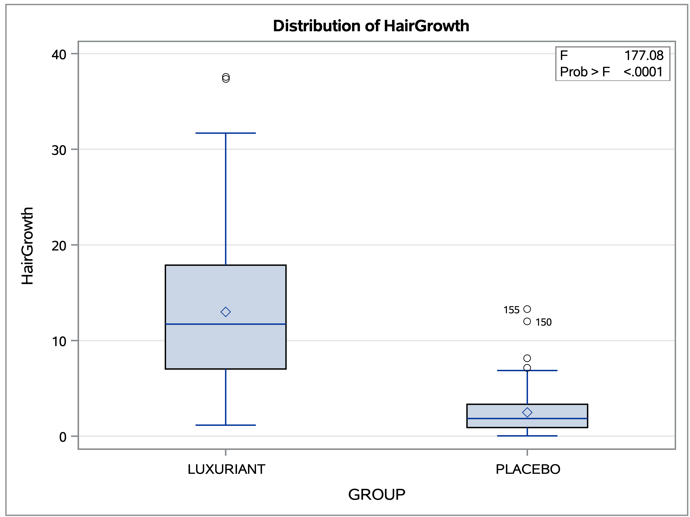
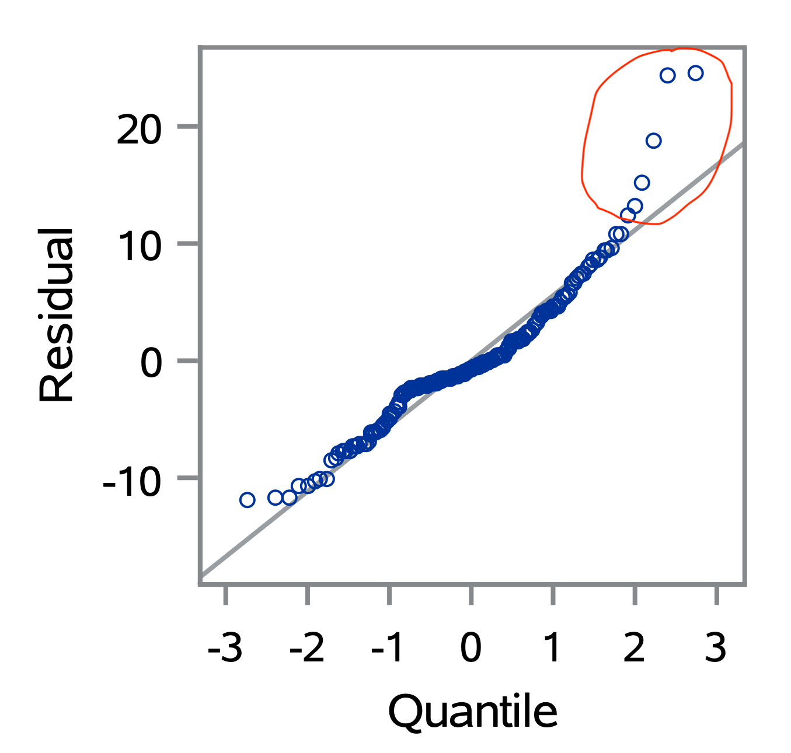
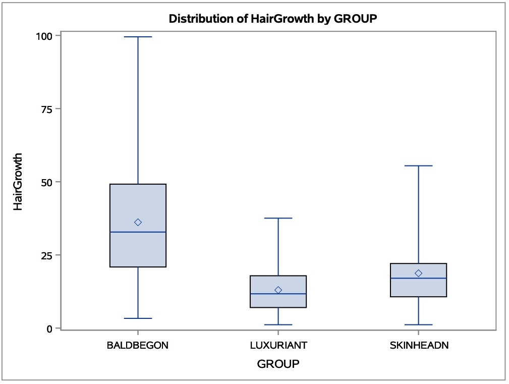
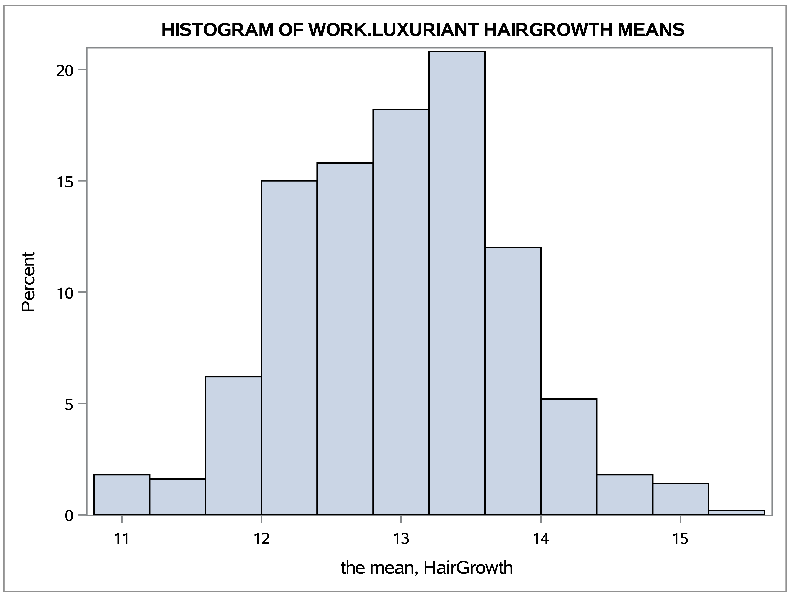
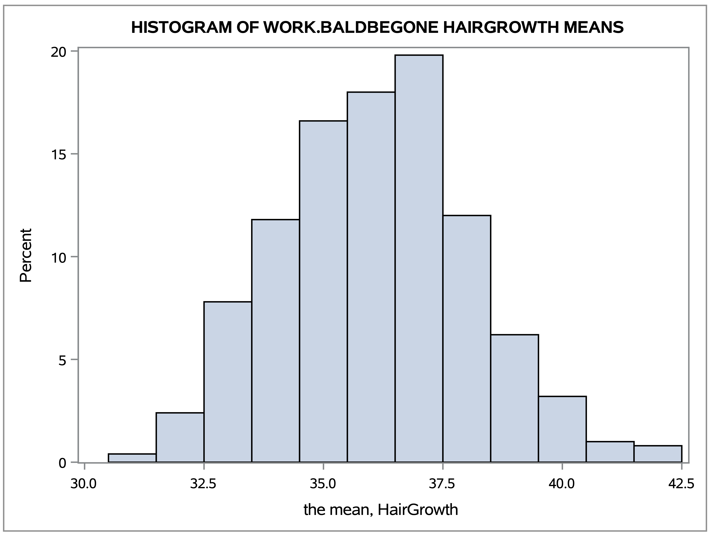
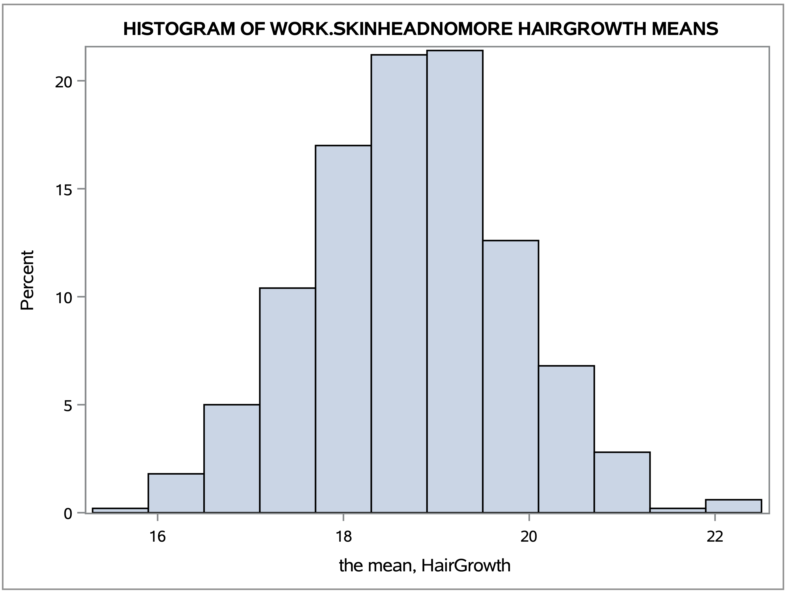
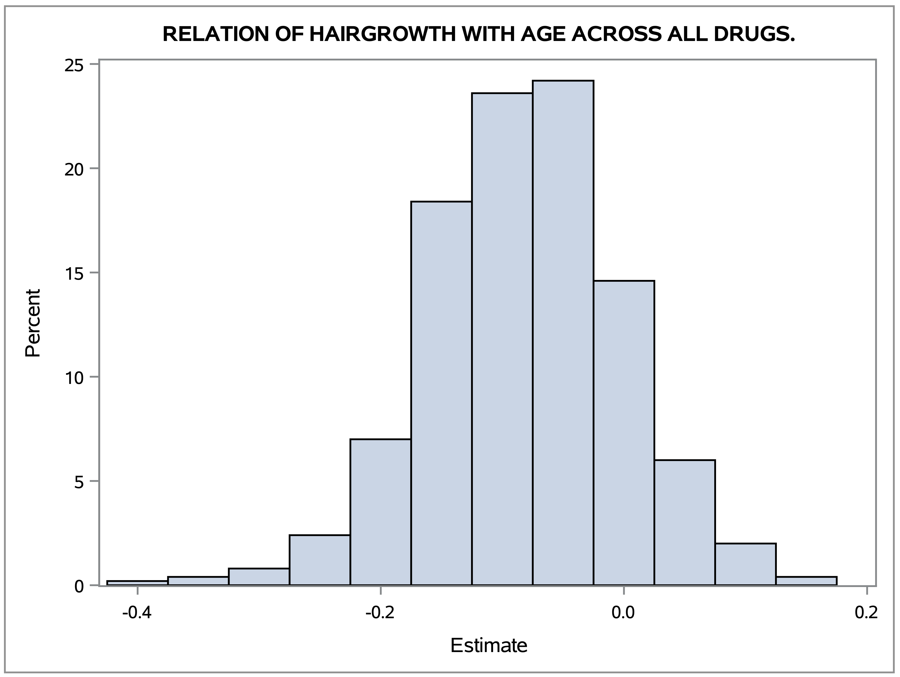
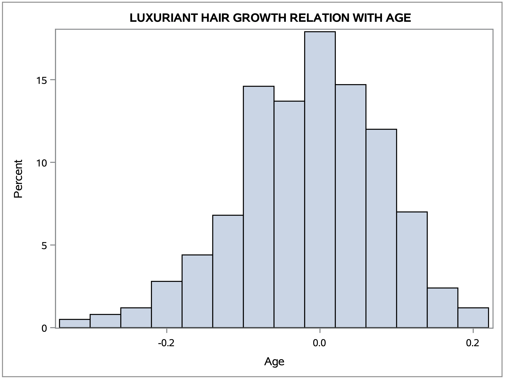

```{r, include=FALSE}
options(tinytex.verbose = TRUE)
library(knitr)
```
 \
 
#### GitHub repository is: [https://github.com/AMLoucas/MT5763_2_200029834](https://github.com/AMLoucas/MT5763_2_200029834) 

## Abstract
<!-- executive summary -->
This project used data collected from a clinical trial that was testing a new drug for male pattern baldness. Our aim is to compare the new drug called Luxuriant against 3 already existing drugs Placebo, Baldbegone and Skinheadnomore. To achieve our aim we will use linear modeling, randomization and bootstrapping tests. Using the confidence intervals from our randomized/bootstrapped data-sets we concluded that Luxuriant is indeed a more efficient drug than Placebo but not from Baldbegone and Skinheadnomore. Additionally regression modeling was applied to understand the relation between hair growth and age. From our regression estimates, we conclude that age is not a significant factor of the patients hair growth from applying the drug. \

## Introduction
<!-- describing the purpose of your investigation -->
The aim of our report is to identify the efficiency of the Luxuriant drug against the other already existing ones. Using the data collected from the clinical trials, we will evolve our data in the desired format and structure to apply statistical analyses on it and answer our question. The SAS code used to achieve our results is included in the APPENDIX with appropriate commenting and explanation. \

## Analysis Descritpion

<!-- clear account of what you did statistically as well as the data wrangling,) and why -->
### Data Wrangling
  All code used to obtain the results we are seeking and for Data Wrangling can be viewed in the APPENDIX. \
  The relevant results and output from the SAS code can be viewed in the Results chapter. This chapter is a summary of how the questions were executed. \
  
  Our data is constructed by 100 rows and 8 columns and holds the age and hair growth length in inches for each drug. In our wrangling process we will break the big data set to 4 individual ones holding data for one 1 drug and hair growth measured in mm. We will then merge our tables and keep the column that we are for the given question. When merging we will add a new column GROUP that represents the drug used on the specific subject. This wrangling procedure will be the same for all the questions. Non-parametric methods will be used since they dont follow any assumptions and our linear modeling assumptions are violated with the given data supplied. \

### For question 1 (Is there an effect of Luxuriant above and beyond the placebo?)

  The columns of interest here are, hair growth of drugs Luxuriant and Placebo. We will fit a linear model using as a response variable Hair growth and as a predictor the drug used, we notice that the normality assumption is violated from QQ-plot. This means that our p-values may not be valid. For this reason we will apply a randomized test on the hair growth means of each drug. \
  We will apply a one tail Hypothesis test on our means to obtain our desired results:
 
 * Ho: MEAN(LUXURIANT) = MEAN(PLACEBO)
 * H1: MEAN(LUXURIANT) > MEAN(PLACEBO)
 
### For question 2 (Is Luxuriant more effective than the existing treatments on the market?)

  The columns of interest here are, hair growth of drugs Luxuriant, Baldbegone and Skinheadnomore. First, we will plot our data in a box-plot to compare the three sets visually. After we will apply a bootstrap algorithm on the 3 effects data to obtain the 95% confidence intervals for the mean values of hair growth. We will then compare our confidence intervals to understand which drug is more effective. \

### For question 3 (is age relevant to any effect?)
 
  All the columns are in our interest in this question. To check the relation between Hair growth and age, we used a bootstrapping method to create random simulated data. Once we obtained the simulations, we fitted a linear model (HairGrowth = Age FACTOR(GROUP)) for each simulation . We will then obtain our Age estimates and p-values to understand the relation. From our estimates we obtain a 95% confidence interval, if 0 is in the interval returned, this means our slope is a straight line and age is not a significant variable on Hair growth. We will also run the same test considering only the Luxuriant group. Large p-values indicates that the predictor is not important. \

## Results
<!-- results clearly explained and presented (includes data visualization-->

### [Q1] Is there an effect of Luxuriant above and beyond the placebo
  From our Box-Plot we can conclude that Luxuriant is more efficient than Placebo, the p-value that the model produced indicates that the two means of hair growth are not equal. \
```{r, echo=FALSE, fig.align='center',  out.width="70%", out.height="70%"}
# All defaults

```

 But because our assumptions are violated we will need to use a randomization test. We can view the violation of the normality assumptions from our residual QQ-plot. \
```{r, echo=FALSE, fig.align='center',  out.width="70%", out.height="70%"}
# All defaults

```
  Using a randomization test we obtained sample means (assumes equal means) and we now compare the original means difference with the randomized means difference. From our results we viewed that there is not a single sample mean differences more significant than our original mean difference. This proves that Luxuriant hair growth length mean is not equal with the Placebo hair growth and mean. So now from the box-plot we know that Luxuriant is more efficient than Placebo. \
  
### [Q2] Is Luxuriant more effective than the existing treatments on the market

  From our box-plot we view that Luxuriant is not more efficient than the already existing drugs. We will further our analyzes using bootstrap algorithm to obtain the means 95% confidence intervals and compare them. \
```{r, echo=FALSE, fig.align='center',  out.width="70%", out.height="70%"}
# All defaults

```

  Viewing the Confidence Interval table and histograms of each drug, we conclude that indeed the Luxuriant drug is not more efficient than the already existing drugs, with most efficient drug being Baldbegone. From the confidence intervals, Luxuriant true hair growth mean is between 11.5622 - 14.5700 which is smaller than the smallest values from the other drugs. \
  
| CI    	| LUXURIANT 	| BALDBEGONE 	| SKINHEADNOMORE 	|
|-------	|-----------	|------------	|----------------	|
| 2.5%  	| 11.5622   	| 32.4356    	| 16.6493        	|
| 97.5% 	| 14.5700   	| 39.9387    	| 20.9198        	| 


```{r, echo=FALSE, fig.align='center',  out.width="70%", out.height="70%"}
# All defaults



```

### [Q3] Is age relevant to any effect?
 
  Using the model that considers all the drugs in the model. We can view from the histogram below that the model estimates contain the value 0. This shows that Age does not affect the drug results in terms of hair growth length. \
```{r, echo=FALSE, fig.align='center',  out.width="70%", out.height="70%"}
# All defaults

```

  We also have an average of Age P-Values 0.39 that indicates that Age is not a significant variable.  \
  We now apply a model only concerning the drug Luxuriant. Having a simple model Hair growth = Age. Our estimation histograms contains again the value 0 which proves that Age does not affect the drug results. \
```{r, echo=FALSE, fig.align='center',  out.width="70%", out.height="70%"}
# All defaults

```


## Conclusions

<!-- conclusions along with criticisms of the design if any -->
  Our new drug Luxuriant is an improvement from Placebo, but is still not more efficient than the drugs Skinheadnomore and Baldbegone. We have also understood that Age was not significant on how efficient the drug was. To improve Luxuriant drug we first must understand what variables affect the results. Since this trial considered only the age of the subject, we could not further investigate what affects the drug in terms of Hair growth. For future trials we should consider recording more variables, weight loss and iron deficiency affect hair loss, those variables should be monitored and analyzed [1]. Additionally, subjects may have weaker hair due to the fact of their family or hormones, these phenomena should be taken under consideration [2]. Another variable to consider is, if the patient is under any other medication or supplements, some of these treatments can affect the drug results[2]. Additionally, it would be better to consider only completely bald subjects, since the random allocation might influence the results. There is a possibility subjects thar were not completely bald were allocated in one drug. \
    Number of simulation used was 500 and 1000 in different simulations, by increasing the simulation N values we will obtain results closer to the true values. \
  
## References

[1] NHS. (2018, January 04). Hair Loss. Retrieved from NHS: https://www.nhs.uk/conditions/hair-loss/ \
[2] CLINIC, M. (n.d.). Hair Loss. Retrieved from MAYO CLINIC: https://www.mayoclinic.org/diseases-conditions/hair-loss/symptoms-causes/syc-20372926 \

## Appendix


#### Code For Question [1] with Linear Regression and Assumptionn Testing
 \

```
/* MT5763 INDIVIDUAL-PROJECT 1 */
/* Question 1 with Linear Regression. */

/* IMPORTING THE CSV FILE TO APPLY COMPUTATIONS */
FILENAME REFFILE '/folders/myfolders/sasuser.v94/Practical-Individual/Baldy.csv';

PROC IMPORT DATAFILE=REFFILE
	DBMS=CSV
	OUT=WORK.BALDY;
	GETNAMES=YES;
RUN;

/* KEEPING ONLY TWO COLUMNS WE INTERESTED */
DATA WORK.BALDY;
	SET WORK.BALDY;
	KEEP LUXURIANT PLACEBO;
RUN;

/* CREATING THE LUXURIANT TABLE 
	CONVERTING THE INCHES TO MM FOR HAIRGROWTH
	PUTTING COLUMN GROUP TO SHOW WHICH GROUP VALUE REPRESENTS */
DATA LUXURIANT;
	SET WORK.BALDY;
	GROUP = "LUXURIANT";
	LUXURIANT = LUXURIANT * 25.4;
	KEEP LUXURIANT GROUP;
	RENAME LUXURIANT = HairGrowth;
RUN;

/* CREATING THE PLACEBO TABLE 
	CONVERTING THE INCHES TO MM FOR HAIRGROWTH
	PUTTING COLUMN GROUP TO SHOW WHICH GROUP VALUE REPRESENTS */
DATA PLACEBO;
	SET WORK.BALDY;
	GROUP = "PLACEBO";
	PLACEBO = PLACEBO * 25.4;
	KEEP PLACEBO GROUP;
	RENAME PLACEBO = HairGrowth;
RUN;

/* SORTING BOTH TABLES BY HAIRGROWTH TO MERGE THEM */
PROC SORT DATA = WORK.LUXURIANT;
	BY HairGrowth;
RUN;
PROC SORT DATA = WORK.PLACEBO;
	BY HairGrowth;
RUN;

/* MERGE BOTH TABLES TOGETHER NOW */
DATA WORK.BALDY;
	MERGE WORK.LUXURIANT WORK.PLACEBO;
	BY HairGrowth;
RUN;


/* FIT A LINEAR MODEL USING THE GROUP AS FACTOR, TO SEE HOW GOOD A TREATMENT IS 
	OUR P-VALUE WILL CHECK IF OUR TWO MEANS ARE EQUALL. IF NOT EQUAL, THA ONE WITH 
	HIGHEST MEAN IS THE BEST TREATMENT */
PROC GLM 
	DATA = WORK.BALDY outstat=ERRORS plots = all;
	CLASS GROUP;
	MODEL HairGrowth = GROUP;
RUN;
QUIT;
```
\

#### Code For Question [1] with Randomisation test
 \

```
/* QUESTION 1 */
/* QUESTION 1 WITH RANDOMISATION TEST */
/* DROPPING TABLES TO RE-CREATE THEM */
/* CODE COULD BE DONE MORE EFFICIENTLY USING BOOSTSTRAP */
/* USED RANDOMIZATION TEST FOR BETTER EXPLANATION */

/* IMPORTING THE CSV FILE TO APPLY COMPUTATIONS */
FILENAME REFFILE '/folders/myfolders/sasuser.v94/Practical-Individual/Baldy.csv';

PROC IMPORT DATAFILE=REFFILE
	DBMS=CSV
	OUT=WORK.BALDYq1;
	GETNAMES=YES;
RUN;

/* DATA WRANGLE TO APPLY RANDOMISED TEST 
 KEEPING ONLY HAIRGROWTH VALUES FOR LUXURIANT AND PLACEBO 
 FINDING THE MEAN FOR THE TWO DIFFERENT GROUPS HAIRGROWTH 
 FINDING THE DIFFERENCE VALUE 
 COMPARING THE ORIGINAL DATA MEAN DIFFERENCE WITH RANDOMISED 
 TO CHECK IF OUR MEANS ARE EQUAL.
 RANDOMISED DATA IS CREATE ASSUMING THE MEANS ARE EQUAL. */

/*------------------------------------------------------*/
/*-------------ORIGINAL MEAN DIFFERENCE---------------- */
/*------------------------------------------------------*/

/* KEEPING ONLY TWO COLUMNS WE INTERESTED */
DATA WORK.BALDYq1;
	SET WORK.BALDYq1;
	KEEP LUXURIANT PLACEBO;
RUN;

/* CREATING THE LUXURIANT TABLE 
	CONVERTING THE INCHES TO MM FOR HAIRGROWTH
	PUTTING COLUMN GROUP TO SHOW WHICH GROUP VALUE REPRESENTS */
DATA LUXURIANT;
	SET WORK.BALDYq1;
	GROUP = "LUXURIANT";
	LUXURIANT = LUXURIANT * 25.4;
	KEEP LUXURIANT GROUP;
	RENAME LUXURIANT = HairGrowth;
RUN;

/* CREATING THE PLACEBO TABLE 
	CONVERTING THE INCHES TO MM FOR HAIRGROWTH
	PUTTING COLUMN GROUP TO SHOW WHICH GROUP VALUE REPRESENTS */
DATA PLACEBO;
	SET WORK.BALDYq1;
	GROUP = "PLACEBO";
	PLACEBO = PLACEBO * 25.4;
	KEEP PLACEBO GROUP;
	RENAME PLACEBO = HairGrowth;
RUN;

/* SORTING BOTH TABLES BY HAIRGROWTH TO MERGE THEM */
PROC SORT DATA = WORK.LUXURIANT;
	BY HairGrowth;
RUN;
PROC SORT DATA = WORK.PLACEBO;
	BY HairGrowth;
RUN;

/* MERGE BOTH TABLES TOGETHER NOW */
DATA WORK.BALDYQ1;
	MERGE WORK.LUXURIANT WORK.PLACEBO;
	BY HairGrowth;
RUN;

/* NEED TO SORT NEW TABLE BY GROUP SO MEANS CAN BE OBTAINED 
	FINDING MEAN VALUES FOR HAIRGROWTH FOR EACH GROUP */
PROC SORT DATA = WORK.BALDYQ1;
	BY GROUP;
RUN;

/* FINDING MEAN OF GROWTH HAIR FOR EACH GROUP 
	RESULT TABLE OF MEANS IS HELD IN VARIABLE "OriginalMeans" */
PROC MEANS data =WORK.BALDYQ1;
	VAR HairGrowth; 
	BY GROUP;
	OUTPUT OUT=OriginalMeans mean=; 
RUN;

/* KEEPING ONLY DATA INTERESTED FROM MEAN TABLE "OriginalMeans" */
DATA WORK.OriginalMeans;
	SET WORK.OriginalMeans;
	KEEP GROUP HairGrowth;
RUN;

/* TransposING TABLE TO GET THE DIFFERENCE OF THE TWO MEANS
	APPLYING A ONE TAIL TEST. ALTERNATIVE HYPOTHESIS:
	LUXURIANT > PLACEBO */
PROC TRANSPOSE 
	DATA= WORK.OriginalMeans 
	out = WORK.OriginalMeans;
RUN;

/* GET ORIGINAL DIFFERENCE LUXURIANT - PLACEBO (H1)*/
DATA WORK.OriginalMeans;
	SET WORK.OriginalMeans;
	DIFFERENCE=COL1-COL2;  /*GETTING DIFFERENCE */
	KEEP DIFFERENCE;
RUN;

/* REPLICATING THE VALUE TO CREATE TABLE SAME LENGTH AS RANDOMIZED DATA
	LENGHT OF RANDOMIZED 500 */
PROC SURVEYSELECT 
	data=WORK.OriginalMeans 
	out=WORK.OriginalMeans 
	seed=2345
	METHOD=urs 
	noprint 
	sampsize=1 
	outhits rep=500; 
RUN;

/* FILTERING COLUMNS TO ONE ONLY INTERESTED 
	"DIFFERENCE" HOLDS THE MEAN DIFFERENCE OF ORIGINAL DATA */
DATA WORK.OriginalMeans ;
	SET WORK.OriginalMeans ;
	KEEP DIFFERENCE;
RUN;


/*------------------------------------------------------*/
/*------------RANDOMIZING MEAN DIFFERENCE-------------- */
/*------------------------------------------------------*/

/* FUNCTION THAT DEALS WITH RANDOMIZATION 
	GETS 6 ARGUMETNS :
	(1)NLoops ->  Number of simulations to compute
	(2)Table -> Data set we will work on.
	(3)GroupVariable -> Variable holding group values.
	(4)GroupOneLabel -> Group of interest(1) "LUXURIANT"
	(5)GroupTwoLabel -> Group of interest(2) "PLACEBO"
	(6)ResponseVariable -> Value we are interested to get mean "HairGrowth"
	*/
%MACRO TwoSampRandTest(NLoops, Table, GroupVariable, GroupOneLabel, GroupTwoLabel, ResponseVariable);

/* STARTS LOOP OF RANDOMIZING NUMBEROFLOOPS TIMES */	
%DO i=1 %TO &NLoops;

	/* CREATING A DATASET HOLDING A RANDOM UNIFROM VALUE
		FOR EACH GROUP. OUR DATA IS CREATED ASSUMING THE MEANS OF
		BOT GROUPS ARE EQUAL. SO BOTH OUR GROUPS WILL HAVE SIMILAR VALUES.*/
	DATA RandomGroup;
		SET &Table
		(KEEP=&GroupVariable); /* ONLY GROUP COLUMN KEEP */
		RandomIndex=rand('uniform'); /* RANDOM UNIFORM NUMBER COLUMN CREATED */
	RUN;
	
	/* SORTS THE DATA SET BY THE RANDOM UNIFORM NUMBERS GENERATED 
		TO SORT THE TABLE IN A RANDOM ORDER AND SHUFFLE THE HAIRGROWTH VALUES
		TO DIFFERENT GROUPS. CHANGING THE VALUES OF HAIRGRWOTH FOR EACH GROUP
		BETWEEN THEM RANDOMLY TO DISTRIBUTE A RANDOM EQUAL GROUPS.*/
	PROC SORT 
		data=RandomGroup 
		out=RandomGroup;
		by RandomIndex;
	RUN;

	/* MERGING RANDOM GROUPS WITH REAL GROUPS */
	DATA WorkingData;
		merge RandomGroup(keep=&GroupVariable) &Table(drop=&GroupVariable);
	RUN;

	/* BREAKING THE MERGED TABLE TO 2 INDIVIDUAL ONES.
		EACH TABLE CORRESPONFING TO ITS APPROPRIATE GROUP*/
		
	DATA WORK.RandomGroup1;
		SET WORK.WorkingData;
		WHERE &GroupVariable=&GroupOneLabel;
	DATA WORK.RandomGroup2;
		SET WorkingData;
		WHERE &GroupVariable=&GroupTwoLabel;
	RUN;
	
	/* GETTING THE MEAN OF HAIRGWOTH FROM GROUP 1. */
	PROC MEANS 
		data=RandomGroup1 noprint;
		var &ResponseVariable;
		output out=GroupOneMean mean=mean;
	RUN;

	/* GETTING THE MEAN OF HAIRGWOTH FROM GROUP 2. */
	PROC MEANS 
		data=RandomGroup2 noprint;
		var &ResponseVariable;
		output out=GroupTwoMean mean=mean;
	RUN;
	
	/* _NULL_ INDICATES THAT DATASET WILL BE DELETED ONCE USED.
	 	symput('GroupOneMean', mean) -> CREATES A MACRO VARIABLE CALLED
	 	"GroupOneMean" THA WILL HOLD THE MEAN FROM GROUP 1 */
	DATA _NULL_;
		SET GroupOneMean;
		CALL symput('GroupOneMean', mean);
	RUN;
	
	/* DOING THE SAME AS ABOVE BUT OBTAINING GROUP 2 MEAN. */
	DATA _NULL_;
		SET GroupTwoMean;
		CALL symput('GroupTwoMean', mean);
	RUN;

	/* OBTAINING THE DIFFERENCE OF THE TWO MEANS. */
	DATA LoopDifference;
		RandomisedMean=&GroupOneMean-&GroupTwoMean;
	RUN;

	/* TABLE THAT WILL HOLD THE SAMPLE MEAN DIFFERENCE OF ALL THE SIMULATION SAMPLE DATA */
	DATA FinalResultRandomised;
		/* IF FIRST RUN OF LOOP PUT THE "LoopDifference" AS FIRST ROW. */
		%IF &i=1 %THEN %DO;
			set LoopDifference;
		%END;
		/* IF NOT FIRST RUN APPEND "LoopDifference" ON THE ALREADY EXISTING TABLE */
		%ELSE %DO;
			SET FinalResultRandomised LoopDifference;
		%END;
	RUN;
	%END;
%MEND;

%TwoSampRandTest(NLoops=500, Table=WORK.BALDYQ1, GroupVariable=GROUP, GroupOneLabel="LUXURIANT", GroupTwoLabel="PLACEBO", ResponseVariable=HairGrowth);

/* JOIN THE RANDOMISED MEANS WITH THE ORIGINAL DIFFERENT MEANS
	SIDE BY SIDE SO WE CAN FIND THE PROPORTION WE ARE INTERESTED IN.*/
DATA FinalResultRandomised;
	MERGE FinalResultRandomised WORK.OriginalMeans;
RUN;

/* FILTER THE ROWS TO KEEP THE ONES THE RANDOMISED MEANS IS LARGER 
	THAN THE ACTUAL DIFFERENT MEAN. IF ITS ABOUT HALF OD THE ACTUAL LENGTH
	250 THEN THIS INDICATES OUR MEANS ARE EQUAL.*/
DATA HypothesisResult;
	SET FinalResultRandomised;
	WHERE RandomisedMean >= DIFFERENCE; 
RUN;
```
\

#### Code For Question [2] with BootStrapping obtaining CI
 \

```
/* MT5763 */
/* INDIVIDUAL PROJECT-1 */
/* QUESTION 2 WITH BOOTSTRAPPING CI FOR A MEAN */

/* IMPORTING THE BALDY CSV FILE DATASET */
FILENAME REFFILE '/folders/myfolders/sasuser.v94/Practical-Individual/Baldy.csv';

PROC IMPORT DATAFILE=REFFILE
	DBMS=CSV
	OUT=WORK.BALDYq2;
	GETNAMES=YES;
RUN;

PROC CONTENTS DATA=WORK.BALDYq2; 
RUN;

/* KEEPING ONLY 3 COLUMNS WE INTERESTED */
DATA WORK.BALDYq2;
	SET WORK.BALDYq2;
	KEEP LUXURIANT BALDBEGONE SKINHEADNOMORE;
RUN;

/* CREATING THE LUXURIANT TABLE 
	CONVERTING THE INCHES TO MM FOR HAIRGROWTH
	PUTTING COLUMN GROUP TO SHOW WHICH GROUP VALUE REPRESENTS */
DATA WORK.LUXURIANT;
	SET WORK.BALDYq2;
	GROUP = "LUXURIANT";
	LUXURIANT = LUXURIANT * 25.4;
	KEEP LUXURIANT GROUP;
	RENAME LUXURIANT = HairGrowth;
RUN;

/* CREATING THE BALDBEGONE TABLE 
	CONVERTING THE INCHES TO MM FOR HAIRGROWTH
	PUTTING COLUMN GROUP TO SHOW WHICH GROUP VALUE REPRESENTS */
DATA WORK.BALDBEGONE;
	SET WORK.BALDYq2;
	GROUP = "BALDBEGONE";
	BALDBEGONE = BALDBEGONE * 25.4;
	KEEP BALDBEGONE GROUP;
	RENAME BALDBEGONE = HairGrowth;
RUN;

/* CREATING THE SKINHEADNOMORE TABLE 
	CONVERTING THE INCHES TO MM FOR HAIRGROWTH
	PUTTING COLUMN GROUP TO SHOW WHICH GROUP VALUE REPRESENTS */
DATA WORK.SKINHEADNOMORE;
	SET WORK.BALDYq2;
	GROUP = "SKINHEADNOMORE";
	SKINHEADNOMORE = SKINHEADNOMORE * 25.4;
	KEEP SKINHEADNOMORE GROUP;
	RENAME SKINHEADNOMORE = HairGrowth;
RUN;

/* WE WILL PLOT A BOXPLOT OF OUR 3 DATASETS TO SEE A SMALL SUMMARY */
/* WE NEED TO SORT ALL SORT EACH INDIVIDUAL TABLE GROUP. SO WE CAN MERGE */
/* THEM USING THE GROUP ATTRIBUTE AND PLOT A BOXPLOT FOR EACH GROUP SIDE-BY-SIDE */

/* SORTING THE TABLES */
PROC SORT DATA = WORK.LUXURIANT;
	BY GROUP;
RUN;
PROC SORT DATA = WORK.BALDBEGONE;
	BY GROUP;
RUN;
PROC SORT DATA = WORK.SKINHEADNOMORE;
	BY GROUP;
RUN;

/* MERGE THE TABLES */
DATA WORK.BOXPLOT;
	MERGE WORK.LUXURIANT WORK.BALDBEGONE WORK.SKINHEADNOMORE;
	BY GROUP;
RUN;

DATA WORK.BOXPLOT;
	SET WORK.BOXPLOT;
	GROUP_C = GROUP;
RUN;

/* PLOT THE BOXPLOT FOR ALL THE GROUPS SIDE BY SIDE */
PROC BOXPLOT data=WORK.BOXPLOT;
   PLOT HairGrowth*GROUP;
RUN;

/* MACRO FUNCTION THAT USES BOOTSTRAPPING TO OBTAIN THE CI OF
	HAIRGROWTH ON OUR GROUP OF INTEREST 
	TAKES 1 ARGUMENT:
		TABLE -> TABLE HOLDING THE HAIRGROWTH OF GROUP WE ARE INTERESTED. */
%MACRO BootCI(TABLE);
	/* BOOTSTRAP OUR TABLES TO OBTAIN CI FOR EACH TABLES MEANS. */
	PROC SURVEYSELECT 
		data=&TABLE /* USING THIS DATA FILE */
		out=WORK.BOOT /* RESULTS WILL BE OUTPUTED IN THIS FILE */
	 	seed=5763 /* TO MAKE CODE REPRODUCIBLE */
	 	/* USE A RANDOM UNIFORM DISTRIBUTION, EACH SIMULATION 100 SAMPLE AND 500 SIMULATIONS */
	  	METHOD=urs noprint sampsize=100 outhits rep=500;
	RUN;
	
	PROC UNIVARIATE 
		data=WORK.BOOT noprint; 
		VAR HairGrowth;
		/* GETS MEAN FOR EACH SIMULATION. 500 SIMULATIONS */
		/* EACH REPLICATE ID CORRESPONDS TO THE SIMULATION IT WAS CALCULATED. */
		/* BY FUNCTION ALLOWS TO FIND THE MEAN OF EACH SIMULATION */
	    BY replicate;
		OUTPUT out=WORK.BOOTMEAN mean=MEAN;
	RUN;
	
	/* GET THE CI OF 95% FOR OUR SPECIFIC GROUP */
	PROC UNIVARIATE 
		data=WORK.BOOTMEAN;
		VAR MEAN;
	    OUTPUT out=WORK.BOOTCI pctlpts=2.5, 97.5 pctlpre=CI; /* 95% CI */
	RUN;
	
	
	/* WE PLOT OUR MEAN DATA IN A HISTOGRAM TO VIEW THE CI */  
	PROC SGPLOT data = WORK.BOOTMEAN;
		TITLE "HISTOGRAM OF &TABLE HAIRGROWTH MEANS";
		HISTOGRAM MEAN;
	RUN;
	TITLE;
%MEND;

/* CALLING BOOTSTRAPPING FUNCTION FOR EACH INDIVIDUAL GROUP */
%BootCI(WORK.LUXURIANT);
%BootCI(WORK.BALDBEGONE);
%BootCI(WORK.SKINHEADNOMORE);
```
\

#### Code For Question [3] with BootStrapping and obtainin CI
 \

```
/* MT5763 */
/* INDIVIDUAL PROJECT-1 */
/* QUESTION 3 WITH RANDOMISATION REGRESSSION */

/* IMPORTING THE BALD CSV DATA */
FILENAME REFFILE '/folders/myfolders/sasuser.v94/Practical-Individual/Baldy.csv';

PROC IMPORT DATAFILE=REFFILE
	DBMS=CSV
	OUT=WORK.BALDq3;
	GETNAMES=YES;
RUN;

PROC CONTENTS DATA=WORK.BALDq3; 
RUN;

/* BREAKING TABLES TO EACH GROUP AND MERGE THEM BACK TOGETHER. */

/* Luxuriant table */
DATA WORK.LUXURIANT;
	SET WORK.baldq3;
	GROUP = "LUXURIANT";
	KEEP Luxuriant AgeLuxuriant GROUP; 
	Luxuriant = Luxuriant * 25.4;
	RENAME Luxuriant = HairGrowth;
	RENAME AgeLuxuriant = Age;
RUN;

/* Placebo table */
DATA WORK.PLACEBO;
	SET WORK.baldq3;
	GROUP = "PLACEBO";
	KEEP Placebo AgePlacebo GROUP;
	Placebo = Placebo * 25.4;
	RENAME Placebo = HairGrowth;
	RENAME AgePlacebo = Age;
RUN;

/* SKINHEADNOMORE TABLE */
DATA WORK.SKINHEADNOMORE;
	SET WORK.baldq3;
	GROUP = "SKINHEADNOMORE";
	KEEP Skinheadnomore AgeSkinheadnomore GROUP;
	Skinheadnomore = Skinheadnomore * 25.4;
	RENAME Skinheadnomore = HairGrowth;
	RENAME AgeSkinheadnomore = Age;
RUN;

/* BALDBEGONE TABLE */
DATA WORK.BALDBEGONE;
	SET WORK.baldq3;
	GROUP = "BALDBEGONE";
	KEEP BaldBeGone AgeBaldbegone GROUP;
	BaldBeGone = BaldBeGone * 25.4;
	RENAME Baldbegone = HairGrowth;
	RENAME AgeBaldbegone = Age;
RUN;

/* Sort all our individual tables by their group(drug)
	So we can then merge all together and have 3 columns only
	HairGrowth, Age, Group (Group indicates the drug that the specific
	row/record has been tested with.) */
PROC SORT DATA=WORK.LUXURIANT;
	BY GROUP;
RUN;
PROC SORT DATA=WORK.PLACEBO;
	BY GROUP;
RUN;
PROC SORT DATA=WORK.BALDBEGONE;
	BY GROUP;
RUN;
PROC SORT DATA=WORK.SKINHEADNOMORE;
	BY GROUP;
RUN;

DATA WORK.MERGEDALL;
	SET WORK.LUXURIANT WORK.PLACEBO WORK.BALDBEGONE WORK.SKINHEADNOMORE;
	BY GROUP;
RUN;

/* BootStrapping data to fit models and obtain estimates
	to understand relation of Age with Hair Growth.
	Each simulation will construct a dataset of 400 rows.
	The simulation will repeat 500 times. Simulation
	is constructed by a random uniform distribution. */
PROC SURVEYSELECT 
	data=WORK.MERGEDALL
	out=WORK.BOOTMERGED seed=23434
	method=urs noprint sampsize=400 outhits rep=500;
RUN;

/* PUTTING GLM MODEL ON ALL REPLICATE SIMULATIONS */
PROC GLM DATA=WORK.BOOTMERGED;
	CLASS GROUP;
	MODEL HairGrowth = AGE GROUP /solution clparm;
	ODS output ParameterEstimates=parEstimates;
	BY REPLICATE;
RUN;
QUIT;

/* Keeping only values we are interested in */
DATA WORK.parEstimates;
	SET WORK.parEstimates;
	WHERE Parameter="Age";
	KEEP Estimate LowerCL UpperCL Probt;
RUN;

/* Obtaining the confidence intervals of the slope. */
PROC SGPLOT data = WORK.parEstimates;
	TITLE "RELATION OF HAIRGROWTH WITH AGE ACROSS ALL DRUGS.";
	HISTOGRAM Estimate;
RUN; 
TITLE;

/* Getting the p-values of all the models. */
PROC UNIVARIATE 
	data=WORK.parEstimates;
	VAR Probt;
	OUTPUT out=WORK.MEAN mean=MEAN;
RUN;

/* Making a bootstrap algorithm only for Luxuriant to se 
	effect on that.
	EACH SIMULATION WILL PRODUCE 100 RADNOM ROWS, SIMULATION 
	WILL BE EXECUTED 1000 TIMES. */
PROC SURVEYSELECT 
	data=WORK.LUXURIANT
	out=WORK.LUXURIANT_BOOT seed=23434
	method=urs noprint sampsize=100 outhits rep=1000;
RUN;

/* Fit regression lines to extract the slope of the linear relation
	to understand what realtion exists between the 2 variables. */
PROC REG 
	DATA=WORK.LUXURIANT_BOOT OUTEST=WORK.LUX_REG NOPRINT;
	MODEL HairGrowth = Age;
	BY replicate;
RUN;

/* Obtaining the confidence intervals of the slope. */
PROC UNIVARIATE 
	data=WORK.LUX_REG;
	VAR Age;
	OUTPUT out=WORK.LUX_CI pctlpts=2.5, 97.5 pctlpre=CI;
RUN;

/* Plotting the Confidence intervals in a histogram. */
PROC SGPLOT data = WORK.LUX_REG;
	TITLE "LUXURIANT HAIR GROWTH RELATION WITH AGE";
	HISTOGRAM Age;
RUN; 
TITLE;
```

